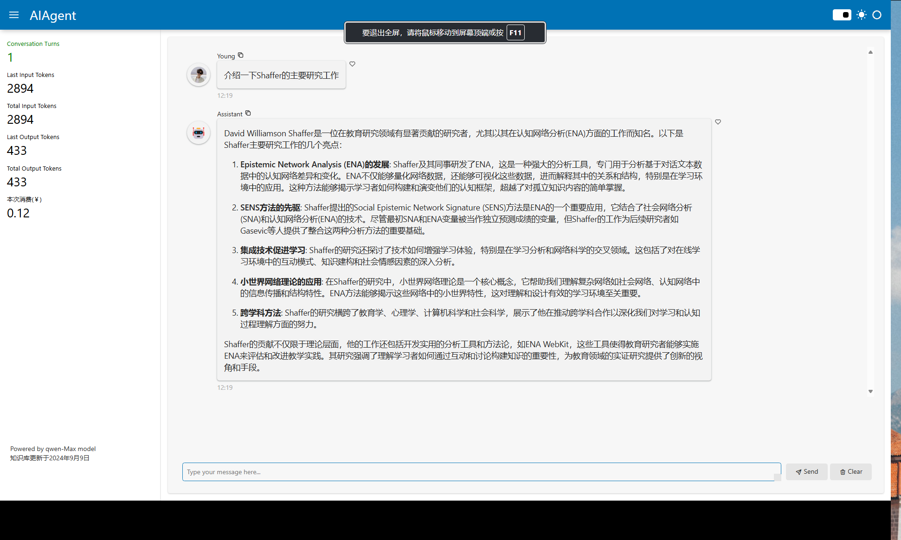

`AliAgent.py` 是一个基于 Panel 框架的 Python 应用程序，用于与云端设定的 Agent 进行对话。该应用程序通过调用阿里云的 API 实现对话功能，并展示对话的统计信息。


## 功能
1. 与云端设定的自定义语言模型进行对话。
2. 显示对话轮次、输入和输出的 token 数量以及对话的总费用。
3. 基于Panel库实现低代码的可视化Python web应用，自定义用户头像和界面样式。
4. 适用于不太懂代码，想要低代码实现个人AI助理的编程小白。
5. 使用思路：
   1. 基于RAG框架，先搭建上传自己的知识库以构建自己的大语言模型应用
   2. 通过APP_ID与API_KEY连接云端指定的AI应用（嵌入自己的笔记知识库）
   3. 启动服务，随后即可随时与自己的AI助手聊天

## 优缺点

### 优点
1. 不需要计算机算力成本，使用线上大语言模型
2. 可自定义使用哪家的语言模型（但需要一点点代码基础，通过阅读对应的官方文档轻微调整call_agent_app的代码逻辑，目前使用的是阿里云百炼模型，个人推荐）

### 缺点
1. 调用线上模型可能需要购买Tokens
2. 目前没能实现流式传输（Panel库支持langchain框架的流式传输，但是阿里云百炼那边，目前AI应用不提供langchain的调用方式，Sad），未来支持后，我再来更新


## 依赖项

- Python 3.x
- `panel`
- `dashscope`
- `param`
- `requests`
- `beautifulsoup4`

## 安装

1. 克隆或下载此项目。
2. 创建并激活虚拟环境（可选）。
3. 安装所需的 Python 包：

    ```bash
    pip install panel dashscope param requests beautifulsoup4
    ```

## 使用方法

1. 确保已设置好阿里云的 API Key，并将其存储在环境变量 `QWEN_API_KEY` 中。
2. 运行以下命令启动服务：

    ```bash
    panel serve AliAgent.py --autoreload
    ```

3. 打开浏览器并访问 `http://localhost:5006/AliAgent` 以使用应用程序。

## 文件说明

- `AliAgent.py`: 主应用程序文件，包含界面定义和对话逻辑。
- `KnowledgeSpider.py`: 用于下载并爬取指定网页内容的脚本。
- `KnowledgeDB.py`: 用于处理知识库文件夹并生成知识库文件的脚本。（基于Obsidian笔记管理逻辑，将markdown文件统一处理到txt文件中，并上传到阿里云百炼，进行进一步的embedding与索引）

## 自定义样式

在 `AliAgent.py` 中，可以通过修改以下 CSS 样式来自定义界面：

```python
pn.config.raw_css.append("""
div > img {
    border-radius: 50% !important;  /* 使图片变成圆形 */
    width: 50px !important; height: 50px !important;
}
.nav.flex-column{
    height: 100% !important;
}
.sidenav  .bk-panel-models-layout-Column {
    height: 85% !important;
}
.bk-panel-models-reactive_html-ReactiveHTML{
    height: 10% !important;
}
""")
